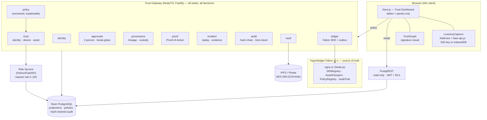
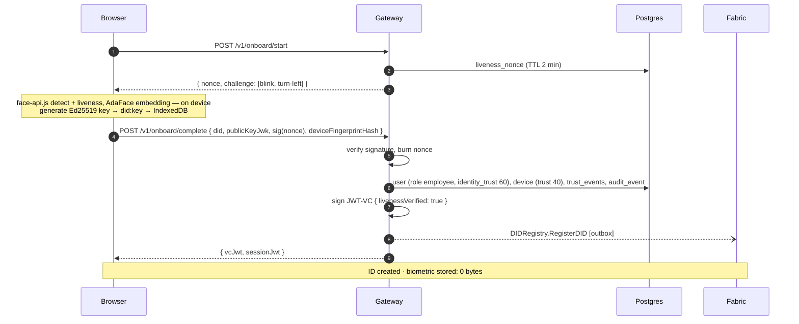

# VAJRA — Architecture & Build Plan (v2)

**A Cryptographic Trust Layer for High-Value Digital Assets**
*Identity · Ownership · Access · Provenance · Evidence*

Tagline: *"Trust, Verified. Access, Controlled."*

One-line USP:

> **VAJRA doesn't just control who can access an asset — it proves who accessed it, why they were allowed, what they did, and whether the asset can still be trusted.**

SIH 2026 · PS SIH26125 (Blockchain-Based Secure Platform for Identity, Access Control, and Digital Asset Management) · Theme: Blockchain & CyberSecurity · Team: The CodePool, Dayananda Sagar University.

Companion docs: [docs/demo-script.md](docs/demo-script.md) (5-minute run-of-show) · [docs/pitch.md](docs/pitch.md) (positioning, slide bullets, judge Q&A).

---

## 0. v1 → v2: what changed and why

v1 was a well-engineered implementation of the *obvious* reading of the PS: DID + liveness + RBAC/ABAC + risk + NFT-style assets + Fabric audit. Every one of those is an **expected component** of SIH26125 — table stakes, not differentiators.

v2 keeps every v1 primitive and adds the **capabilities that only emerge from combining them**:

| Added in v2 | What it is | Built on which PS primitive |
|---|---|---|
| **Trust Engine** (trust ≠ risk) | Identity, device and asset trust scores that decay and recover; privileges shrink automatically under low trust | RBAC + risk + DID |
| **Explainable decisions** | Every ALLOW / STEP-UP / DENY ships a human-readable `DecisionTrace` ("why was I denied?") | Smart-contract governance + RBAC |
| **Proof-of-Action** | A signed, independently verifiable certificate for every sensitive decision | Immutable activity records |
| **Incident Engine** | Anomalies grouped into incidents; automatic response ladder; one-click **attack replay**; signed **evidence package** | Immutable records + AI risk |
| **Approvals** | Two-person rule for critical actions; time-boxed **break-glass** emergency access | Smart-contract governance |
| **Policy versioning** | Policies are immutable versions, hash-anchored on chain; every decision cites the exact version it ran under | Smart-contract governance |
| **Provenance** | Asset lineage (versions, derivatives, copies), sensitivity propagation, chain of custody, signed download manifests ("copy doesn't mean escape") | NFT-based asset ownership |
| **Revocation cascade** | One click revokes VC → sessions → device trust → grants → live URLs → anchors it | DID + immutable records |
| **Time-travel audit** | Reconstruct exactly what the organisation believed at any timestamp | Immutable records |
| **Trust Graph** | Signature UI: person ↔ device ↔ asset ↔ policy ↔ decision ↔ block | All of the above |

Explicitly **cut** from the build: cross-chain verifier, ZK marketplace, multi-tenant SaaS, mobile app, deep ERP integration, deepfake-video defence, learned ML models, token economics. They stay on the roadmap slide.

The product pipeline in five words:

```
IDENTITY  →  TRUST  →  DECISION  →  ASSET  →  PROOF
```

---

## 1. Positioning

### 1.1 The Trust Firewall

A traditional firewall decides `IP → PORT → ALLOW/DENY`. VAJRA decides:

```
PERSON + DEVICE + LOCATION + TIME + ROLE + ASSET + ACTION + RISK + LIVE PROOF + POLICY
                                        ↓
                          ALLOW  /  STEP-UP  /  DENY
                                        ↓
                    decision attached to the asset, proven on the ledger
```

*"Traditional firewalls protect networks. VAJRA protects the assets inside them — and proves every decision."*

### 1.2 Trust that travels with the asset

Today: `USER → IAM → ACCESS → FILE`. The file knows nothing about its own history.

VAJRA: the asset carries its trust history.

```
                 ┌── WHO created it?
                 ├── WHO owns it?
                 ├── WHO modified it?            every answer is
   ASSET ────────┼── WHO accessed it, and WHY?   cryptographically
                 ├── WAS the person authorised?  provable, and the
                 ├── WAS the device trusted?     asset carries a
                 ├── WAS the context safe?       live TRUST SCORE
                 ├── WAS the action approved?    summarising it
                 └── CAN WE PROVE ALL OF THIS?
```

### 1.3 PS coverage map (so judges see we did not drift)

| SIH26125 asks for | VAJRA primitive | VAJRA capability on top |
|---|---|---|
| Decentralised identities | `did:key` in-browser, JWT-VC, on-device liveness | Continuous trust, revocation cascade, step-up proof |
| NFT-based asset ownership | `AssetPassport` chaincode (non-fungible asset record) | Asset Trust Passport, lineage, custody, derivative detection |
| Smart-contract governance | `PolicyRegistry` + `AssetPassport.Transfer` enforce approvals on chain | Versioned policy-as-code, two-person rule, break-glass |
| RBAC | Policy engine (RBAC → ABAC → trust → risk) | Explainable decisions, adaptive privileges |
| Immutable activity records | Hash-chained `audit_events` anchored on Fabric | Proof-of-Action, attack replay, evidence package, time-travel |

---

## 2. System overview



**Division of labour**

| Component | Owns | Never does |
|---|---|---|
| Web app | Camera, DID keys, liveness UX, tables, graph rendering | Business logic, decisions |
| Trust Gateway | All writes, decisions, trust maths, proofs, incidents, ledger submissions, encryption | Storing biometrics |
| Risk Service | Per-request risk from context signals | Making the final decision |
| PostgREST | RLS-scoped reads for dashboards/audit | Any write |
| Postgres | Projections, policies, trust state, hash-chained audit log | Being the source of truth |
| Fabric + chaincode | Truth: DID anchors, asset ownership/lineage, policy hashes, audit/incident anchors | Files, PII, biometrics |

**Design rule:** on-chain = hashes, ownership, policy versions, decisions. Off-chain = everything else. If Postgres and Fabric disagree, Fabric wins and the cache is rebuilt from chain history.

---

## 3. Trust Gateway — module map

```
apps/gateway/src/
  modules/
    identity/     onboarding, nonces, VC issue/revoke, sessions, REVOCATION CASCADE
    policy/       versioned policy store, decision algorithm, DecisionTrace (explainability)
    trust/        identityTrust · deviceTrust · assetTrust · decay/recovery · adaptive privileges
    risk/         client to risk service (150 ms timeout → fail closed to tier high)
    approvals/    single / two-person / break-glass approval state machines
    provenance/   passports, versions, derivatives, sensitivity propagation, custody, signed manifests
    proof/        Proof-of-Action certificates: build, sign, verify
    incident/     anomaly grouping, response ladder, attack replay, evidence packages
    audit/        hash-chain writer, anchor scheduler, proofs, TIME-TRAVEL reconstruction
    vault/        upload → encrypt → pin → mint; single-use decrypted downloads
    ledger/       Fabric Gateway SDK driver + `lite` fallback driver + outbox
    health/       dependency probes → fail-closed switches
  plugins/        auth (JWT + session_version), zod validation, rate limit, CORS
  db/             drizzle schema + migrations
```

One rule binds every module: **every state mutation is written through `audit/`** (event-sourcing-lite). That single rule is what makes time-travel, attack replay and evidence packages cheap instead of impossible.

---

## 4. Engines in detail

### 4.1 Identity — DID, VC, revocation cascade

- **DID:** `did:key` (Ed25519 via WebCrypto; P-256 fallback). Keypair generated in the browser; private key is a non-extractable `CryptoKey` in IndexedDB. No server custody.
- **Liveness, matching on-device:** AdaFace IR-50 computes a 512-d embedding **in the browser** (onnxruntime-web, in a worker, on an ArcFace-aligned 112x112 crop); face-api.js supplies the detector, the 68 landmarks AdaFace aligns on, and the per-frame descriptor behind the `consistency` signal. An active challenge (blink + head-pose over ~3 s of frames) must pass. **The match itself never runs on the server** — a *check* uploads a 0-100 confidence and the frame it was computed from, never an embedding. Step-up = on-device match (cosine similarity ≥ 0.32) + fresh challenge + a signature over the server nonce with the DID key. The one thing that is stored is the enrolment template, encrypted at rest under the gateway KEK and handed back only to a browser starting that identity's login; `docs/HOW-IT-IS-BUILT.md` sets out that trade and why it is made.
- **Live AI check (presentation-attack detection):** MiniFASNetV2 from [Silent-Face-Anti-Spoofing](https://github.com/minivision-ai/Silent-Face-Anti-Spoofing) (Apache-2.0), also in the browser, also in a worker — 1.7 MB, ~2 ms a patch, scored every 600 ms on an 80x80 crop taken at the 2.7x scale the checkpoint was trained at. It is a *second opinion*, not a seventh signal: the six passive signals are hand-written physics that each refuse one specific thing, and this is a classifier trained on real attacks that judges the whole scene — the bezel, the print edge, the sheen of a screen — which is what generalises to the well-shot replay and the rendered face. The session reports the **median** live probability over its frames (a mid-turn or motion-blurred frame is one the model is entitled to be unsure about; a mean would let two of them lock somebody out of their own account). The browser reports, the gateway judges against `ANTISPOOF_MIN_LIVE`, and a capture below the floor fails the `liveness` gate **and** opens an S3 incident. The browser deliberately does not refuse on its own: it signs and submits anyway, so the attack lands in the record instead of being suppressed by the attacker's own page. No weights on the device ⇒ reported *unmeasured*, recorded as unmeasured, never as a pass. Input scaling is `[0, 255]` BGR, not the `[0, 1]` every published description of that model claims — see `apps/web/public/models/README.md`.
- **VC:** gateway (issuer `did:web:vajra.local`) signs a JWT-VC `{ role, org, livenessVerified: true, enrolledAt }`; VC hash anchored via `DIDRegistry.RegisterDID`.
- **Sessions:** 15-min JWT `{ sub: did, role, deviceId, sv }` where `sv` = `users.session_version`. Bumping `sv` kills every live session instantly.
- **Revocation cascade** (`POST /v1/identities/:did/revoke`) — one transaction, in order:

```
Revoke VC (status=revoked)
  → bump session_version (all sessions die)
  → devices.trusted = false for that DID
  → delete grants; cancel pending approvals they requested or must approve
  → expire every active access_request / content URL
  → identity_trust = 0
  → audit event `identity.revoked` (hash-chained)
  → DIDRegistry.RevokeDID on Fabric (outbox)
```

Demo: `ACCESS ✓` → click Revoke → same request → `ACCESS ✗ — IDENTITY REVOKED`.

### 4.2 Policy engine — versioned policy-as-code + explainable decisions

**Policies are immutable versions.** Editing a policy closes the current version (`active_to = now()`) and creates the next; the spec hash is anchored via `PolicyRegistry.AnchorPolicyVersion`. Every decision stores `policy_version_id + spec_hash`, so an auditor never hears "they were allowed" — they hear *"allowed under POL-001 v1.7 (hash 9c4e…), identity trust 88, device trust 75, risk 18, approved by did:key:z6Mk…"*.

Policy spec (JSONB):

```json
{
  "id": "POL-009", "name": "Design downloads",
  "subject":   { "role": ["engineer", "manager"] },
  "action":    "asset.download",
  "resource":  { "class": ["design"], "sensitivity": ["high"] },
  "condition": { "hours": [8, 20], "deviceTrusted": true, "maxRiskTier": "elevated" },
  "effect":    "step_up",
  "approval":  { "approverRole": "manager", "count": 1, "distinctFromRequester": true },
  "breakGlass": { "eligibleRoles": ["admin"], "ttlMinutes": 15, "approverRole": "manager" },
  "priority":  100
}
```

`effect ∈ { allow, deny, step_up, require_approval }`.

**Decision algorithm** — a pure function in `packages/policy`, unit-tested with no I/O:

```
decide(ctx) → { verdict, trace, reason, policyVersion }

 1. Fail-closed gate   required deps healthy?                      else DENY dependency_down:<dep>
 2. Identity gate      session valid, sv current, VC not revoked   else DENY identity
 3. RBAC               an active allow/step_up/require_approval policy matches (role, action, resource)
                                                                    else DENY no_policy
 4. Explicit denies    a matching deny policy with higher priority → DENY policy:<id>
 5. ABAC               hours, deviceTrusted, sensitivity conditions → any fail ⇒ DENY <condition>
 6. Trust gates        identityTrust ≥ min(action), deviceTrust ≥ min(action)   (table in §4.3)
                          below hard floor ⇒ DENY trust_low ; below soft floor ⇒ STEP_UP
 7. Risk overlay       tier high ⇒ DENY risk_high ; tier elevated or action sensitive ⇒ STEP_UP
 8. Approval overlay   effect require_approval, or action critical ⇒ PENDING_APPROVAL after step-up
 9. Emit audit event ALWAYS (denials are evidence) + trace, return verdict
```

**DecisionTrace** — the explainability contract, stored with the request and rendered verbatim in the UI and in proof certificates:

```json
{
  "verdict": "DENY",
  "policyVersion": { "id": "POL-009", "version": 3, "hash": "9c4e…" },
  "checks": [
    { "id": "identity",  "label": "Identity verified",                    "result": "pass" },
    { "id": "role",      "label": "Role authorised: manager → download",  "result": "pass" },
    { "id": "ownership", "label": "Asset ownership verified on ledger",   "result": "pass" },
    { "id": "device",    "label": "Device trusted",                       "result": "fail", "detail": "first seen 2 min ago (trust 40 < 60)" },
    { "id": "hours",     "label": "Within working hours",                 "result": "fail", "detail": "02:13 vs baseline 08–20" },
    { "id": "risk",      "label": "Request risk 74 / high",               "result": "fail", "signals": ["new_device", "impossible_travel", "odd_hours"] }
  ],
  "reason": ["device_untrusted", "outside_hours", "risk_high"]
}
```

UI renders it as: `✓ Identity verified · ✓ Role authorised · ✗ Device not trusted · ✗ Outside working hours · ⚠ Risk 74 → DECISION: DENY`.

### 4.3 Trust Engine — trust ≠ risk

**Risk** answers *"how suspicious is this request?"* (per request, from the risk service). **Trust** answers *"how trustworthy is this identity / device / asset right now?"* (persistent, decays and recovers). Both feed the decision; both are shown to the user.

| Score | Range | Starts at | Goes down when | Goes up when |
|---|---|---|---|---|
| **Identity trust** | 0–100 | 60 (new user, conservative — per deck) | failed liveness −15 · new device first use −8 · incident opened −30 · revoked → 0 | successful step-up +3 · manager approval of their request +5 · clean day +2 (cap 85) · HR/admin attestation sets floor 80 |
| **Device trust** | 0–100 | 40 (unknown device) | failed liveness on device −20 · impossible travel −25 | successful step-up on device +10 (cap 80) · admin marks trusted → 90 |
| **Asset trust** | 0–100 | computed | see breakdown below | recomputed on every provenance/audit event |

Every change writes a `trust_events` row (`subject, delta, reason, score_after, ts`) — that is the "trust decay" timeline the demo shows:

```
08:00 trust 96 · 08:30 new location → 82 · 09:15 new device → 61 · 09:17 failed liveness → 42 · 09:18 sensitive request → DENIED
10:00 trusted device +5 · 11:00 normal activity +3 · 12:00 manager approval +10 → 45 (recovering)
```

**Asset trust breakdown** (the "Why 94?" panel — rule-based, fully explainable):

| Component | Max | Rule |
|---|---|---|
| Verified origin | 20 | minted by a liveness-verified DID; mint tx on chain |
| Verified owner | 20 | current owner DID valid & non-revoked; transfer chain on ledger is consistent |
| Controlled version history | 15 | every version anchored; no gaps; hashes match |
| No unauthorised access | 15 | no incident referencing the asset in 30 d; scaled by denied-attempt count |
| Trusted devices | 10 | share of accesses from devices with trust ≥ 60 |
| Verified approvals | 10 | every action that required approval has one |
| Integrity & completeness | 10 | latest CID re-hashes to the anchored SHA-256; passport metadata complete |

**Trust gates per action class** (used in step 6 of the decision algorithm):

| Action class | Examples | Min identity trust (soft / hard) | Min device trust (soft / hard) | Risk tier allowed |
|---|---|---|---|---|
| low | list, view metadata | 30 / 10 | 20 / 0 | low, elevated |
| medium | open content, view passport detail | 50 / 30 | 40 / 20 | low; elevated ⇒ step-up |
| high | download high-sensitivity, transfer, export | 65 / 45 | 60 / 40 | low; elevated ⇒ step-up + approval if policy says |
| critical | edit policy, revoke admin, delete asset | 75 / 60 | 70 / 50 | low only; two-person always |

*Soft floor ⇒ STEP_UP. Hard floor ⇒ DENY.*

**Adaptive privileges ("self-healing trust")** — the effective permission set is `rolePermissions ∩ trustGates(currentTrust)`. The UI shows it live:

```
Normal:            VIEW ✓   DOWNLOAD ✓         TRANSFER ✓   EXPORT ✓
After anomaly:     VIEW ✓   DOWNLOAD STEP-UP   TRANSFER ✗   EXPORT ✗
```

Permissions are not what the user *has*; they are what the user has *under current trust conditions*.

### 4.4 Risk Service (`apps/risk`, Python/FastAPI)

Stateless per request; reads baselines from Postgres. **Explainable heuristics, not a model** — say "continuous evaluation of contextual trust signals", never "AI detects hackers"; the interface accepts a learned model later.

```
POST /score
{ did, deviceId, ip, action, assetSensitivity, localHour, recentFailures, recentSensitiveCount }
→ { score: 63, tier: "elevated", signals: ["new_device", "odd_hours"] }
```

| Signal | Points |
|---|---|
| Device never seen for this DID | +30 |
| Impossible travel vs last request (IP geo, > 500 km/h) | +25 |
| Failed liveness in last 15 min | +25 |
| Outside baseline hours (rolling 30-day histogram) | +15 |
| Burst: > 10 sensitive requests / 5 min | +15 |
| Abnormal volume: > 3× daily average of assets touched | +15 |
| New user (< 48 h) | tier floor `elevated` |

Tiers: `low` 0–29, `elevated` 30–59, `high` 60+. p95 < 50 ms; gateway timeout 150 ms ⇒ tier `high` (fail closed).

### 4.5 Approvals — two-person rule and break-glass

**Two-person (4-eyes) rule.** For critical actions no single human can act alone:

```
Requester (DID A)            VAJRA                       Approver (DID B, role manager, B ≠ A)
  request transfer ─────────▶ policy: require_approval
  step-up liveness ─────────▶ request → PENDING_APPROVAL ──▶ inbox
                                                           ◀── approve + step-up liveness (own nonce)
                              verify B's attestation
                              AssetPassport.Transfer(asset, A, to, requestId, approverDid=B)
                              audit: `approval.granted`, `asset.transferred`
                              Proof-of-Action cites BOTH liveness attestations
```

Default critical set: transfer high-sensitivity asset · delete asset · edit/activate policy · revoke an admin · export AI model · issue privileged credential.

**Break-glass (emergency access).** Normal policy says DENY at 3 a.m.; the admin needs in anyway. Requirements enforced by the gateway, all of them:

```
reason text required · live identity · approver (manager) live identity · TTL 15 min (auto-expire)
elevated monitoring flag on the session (every action tagged break_glass.*) · risk floor raised
permanent audit + AuditTrail.AnchorEvent(type=break_glass) · countdown shown in the UI
```

### 4.6 Provenance — the Asset Trust Passport

The passport is the flagship. Technically it is a non-fungible asset record on Fabric; in the pitch it is a **Digital Asset Passport** (see [docs/pitch.md](docs/pitch.md) on wording).

```
HAL_TEJAS_ENGINE_v17 — ASSET PASSPORT
Asset ID VAJRA-ASSET-92831 · Classification HIGHLY SENSITIVE · Owner DRDO Design Division
Created by Engineer-DID-82A on 14 Aug 2026 · Versions v1 → … → v17
Integrity ✓ VERIFIED · Ownership ✓ VERIFIED · Origin ✓ VERIFIED
Approvals 7 · Access events 243 · Last access 26 Aug 14:22 · Risk LOW · TRUST SCORE 94/100  [Why 94?]
```

**Lineage model.** Every asset and every `asset_versions` row carries `parent_asset_id`, `parent_sha256`, `lineage_type ∈ {version, derivative, copy}`. On chain: `AssetPassport.LinkDerivative(childUid, parentUid, relation)`.

- **Sensitivity propagation:** a new asset declared as derived from a parent inherits `max(parent.sensitivity)`; lowering it requires a `require_approval` policy. Classification travels with the lineage (`CAD → Simulation → Report → Manufacturing model`).
- **Copy doesn't mean escape:** every download delivers the file **plus a signed sidecar manifest** `<file>.vajra.json` `{ assetUid, version, sha256, owner, classification, policyVersion, gatewaySignature }`. On any re-upload the gateway hashes the content: exact match ⇒ *"this is CAD-TURBINE-V4 v4 renamed to final_final_REAL.cad — sensitivity HIGH, provenance VERIFIED"*.
- **Authorised derivative detection:** upload with a declared parent + the uploader holds a `modify` grant ⇒ `AUTHORISED DERIVATIVE ✓`. Upload whose manifest names a parent but the uploader lacks rights, or a hash that matches a known asset uploaded by a non-owner ⇒ `✗ UNKNOWN / UNAUTHORISED DERIVATIVE` → flagged, incident-eligible. *(MVP detects exact hashes and declared lineage; fuzzy content similarity is roadmap.)*
- **Chain of custody** is a projection, not new storage: `custody_events` view = every audit event on the asset joined to its request (WHO · WHEN · WHY · ACTION · POLICY VERSION · RISK · APPROVAL · HASH) ordered by `seq`. Rendered as `Creator → Engineer A → Design review → Engineer B → Manager approval → Manufacturing → Auditor`.
- **Passport templates per asset class:** `design` (CAD), `model` (**AI Model Passport**: dataset id, training run, framework, model hash, approved-by, deployment stage — AI supply-chain provenance), `certificate` (issuer DID, holder DID, public verify page — an extension, never the primary demo), `document`.

### 4.7 Proof Engine — Proof-of-Action

Audit logs answer *who accessed what*. A Proof-of-Action answers *can anyone independently verify that this decision happened, under which rules, with which evidence?*

For every sensitive decision the gateway builds a certificate:

```json
{
  "certId": "PoA-2026-08-26-000431",
  "actor": "did:key:z6Mk…", "asset": "CAD-TURBINE-V4", "version": 4, "action": "download",
  "decision": "ALLOW", "decidedAt": "2026-08-26T14:31:42Z",
  "policy": { "id": "POL-009", "version": 3, "hash": "9c4e…" },
  "trust": { "identity": 88, "device": 75, "asset": 94 }, "risk": { "score": 18, "tier": "low" },
  "device": "sha256(fingerprint)…", "liveness": { "attestationHash": "…", "verified": true },
  "approvals": [ { "approver": "did:key:z6Mk…B", "attestationHash": "…" } ],
  "trace": { "…DecisionTrace…" },
  "audit": { "eventId": "…", "chainHash": "…", "prevHash": "…", "fabricTxId": "…", "block": 1042 },
  "issuer": "did:web:vajra.local", "signature": "ed25519:…"
}
```

**Verification** (`POST /v1/verify/proof` or the `/verify` page, usable by anyone with an auditor role): (1) canonicalise + re-hash → matches; (2) issuer signature valid; (3) `chainHash` recomputes from `prevHash ∥ payloadHash` in `audit_events`; (4) `AuditTrail.GetEvent(eventId)` on Fabric returns the same `chainHash`; (5) policy hash matches `PolicyRegistry`. All five ⇒ `PROOF VALID ✓`. The certificate is self-contained JSON — it can be emailed to a regulator and verified against nothing but the ledger.

### 4.8 Incident Engine — detection, response, attack replay, evidence

**Detection rules** (evaluated after every decision, per DID, 15-minute sliding window):

| Rule | Opens / attaches incident |
|---|---|
| Any decision with risk tier `high` | open, severity S2 |
| ≥ 2 failed liveness attempts | open, S2 |
| Live AI check reports a presentation attack | open, **S3** — first occurrence |
| ≥ 3 distinct anomaly signals | open, S2 |
| Burst / abnormal-volume signal on sensitive assets | attach, escalate to S3 |
| Unauthorised derivative upload | open, S2 |

A presentation attack goes straight to S3 where a merely failed liveness check needs two attempts,
and the asymmetry is deliberate: a low passive score is usually bad light or somebody who did not
blink when asked, and locking them out of their own account for that is its own kind of failure. A
model that has just watched a screen being held up to a camera is not describing a bad afternoon.
Every path that can see one — signup, login, step-up, an administrator's approval — funnels through
`reportPresentationAttack`, so the consequence is identical wherever the attack was aimed. What it
does *not* do is revoke the identity: that stays an administrator's decision, made against the
incident this opens.

**Automatic response ladder** (this is where the "AI" actually changes security posture):

```
S1  force step-up on every action                     (trust −10)
S2  freeze high/critical actions via adaptive privileges; DOWNLOAD → STEP-UP, TRANSFER → ✗   (trust −30)
S3  lock session (bump session_version) · revoke temporary grants · expire content URLs
    · notify security (webhook + console) · AuditTrail.AnchorIncident(incidentId, chainHash)
```

Closing an incident (admin, with liveness, reason required) as `resolved` or `false_positive` — the latter restores the trust deltas.

**Attack replay** — `GET /v1/incidents/:id/timeline` returns the incident's audit events in `seq` order with their risk/trust values:

```
02:07 login · 02:08 new device (trust 61) · 02:09 failed liveness (42) · 02:10 failed liveness (27)
02:11 impossible travel BLR→BOM/8 min · 02:12 classified CAD requested · 02:12 risk 91 → DENY
02:12 session locked · 02:12 incident INC-2042 anchored (tx 8f2a…)
```

**Evidence package** — `GET /v1/incidents/:id/evidence` bundles incident, every event (with chain hashes and Fabric tx ids), every Proof-of-Action, policy versions in force, trust events, liveness results, hashes; then `packageHash` + gateway signature. `POST /v1/verify/evidence` re-checks every link. A government/defence-grade forensic artefact produced in one click.

### 4.9 Audit — hash chain, anchoring, time-travel

- **Hash chain:** `chain_hash(n) = SHA-256( chain_hash(n−1) ∥ SHA-256(canonical_json(payload)) )`, strict `seq` ordering, each `chain_hash` anchored via `AuditTrail.AnchorEvent`. Editing any historical row breaks every later hash against the on-chain anchors.
- **Async anchoring:** decisions return immediately; the outbox submits to Fabric and patches `fabric_tx_id` on commit (at-least-once). Decision latency stays < 300 ms while the ledger stays authoritative.
- **Time-travel (`GET /v1/timetravel?at=<ts>&did=…&asset=…`)** — *"what did the organisation believe was true at 10:42 on 14 Aug?"* Reconstructed by replaying event streams up to `ts` — no snapshot store:

| Facet | Reconstructed from |
|---|---|
| User role, status, VC state | `audit_events` of type `user.*`, `credential.*` ≤ ts |
| Identity / device trust | last `trust_events.score_after` ≤ ts |
| Active policy versions | `policy_versions` where `active_from ≤ ts < active_to` |
| Asset owner / version / sensitivity | `AssetPassport.GetHistory` filtered by tx timestamp (cache: `asset_versions`, `asset_transfers`) |
| Effective permissions | re-run `decide()` with the reconstructed inputs — the pure function makes this free |
| Approvals, incidents | rows with `decided_at / opened_at ≤ ts` |

### 4.10 Vault, ledger, reads, health

- **Vault:** upload → stream SHA-256(plaintext) → AES-256-GCM with a fresh per-version DEK → SHA-256(ciphertext) → pin to Pinata → wrap DEK with master KEK (env in dev; KMS roadmap) → `asset_versions` row → `AssetPassport.Mint / AddVersion`. Download only via an **approved `access_requests.id`** (single-use, 5-min expiry) → decrypt → stream + signed manifest.
- **Ledger:** fabric-samples `test-network`, 2 orgs (Org1 = platform, Org2 = auditor — an on-stage story), channel `vajrachannel`, Raft, TLS. `@hyperledger/fabric-gateway` from `ledger/`. `LEDGER_BACKEND=fabric|lite` — `lite` is an interface-identical append-only Postgres driver; demo runs `fabric`, `lite` is insurance.

| Contract | Functions | Keys |
|---|---|---|
| `DIDRegistry` | `RegisterDID(did, pubKeyHash, vcHash)` · `RevokeDID(did, reasonHash)` · `Get(did)` | `did:<did>` |
| `AssetPassport` | `Mint(uid, ownerDid, sha256, cid, class, sensitivity, metaHash)` · `AddVersion(uid, ver, sha256, cid)` · `LinkDerivative(childUid, parentUid, relation)` · `Transfer(uid, fromDid, toDid, requestId, approverDid)` · `Get(uid)` · `GetHistory(uid)` | `asset:<uid>` |
| `PolicyRegistry` | `AnchorPolicyVersion(policyId, version, specHash, activeFrom)` · `ClosePolicyVersion(policyId, version, activeTo)` · `Get(policyId, version)` | `policy:<id>:<ver>` |
| `AuditTrail` | `AnchorEvent(eventId, chainHash, type, summaryHash)` · `AnchorIncident(incidentId, chainHash, severity)` · `GetEvent(id)` | `audit:<id>` · `incident:<id>` |

`Transfer` enforces on chain that `approverDid ≠ fromDid` and `approverDid` is registered when the asset's sensitivity is `high` — governance the ledger itself refuses to bypass. `GetHistory` is the provenance tree for free.

- **PostgREST:** read-only DB role, JWT shared with the gateway, RLS by claim `role` (`employee` → own rows and owned assets; `auditor` → all audit/incident/proof tables; `admin` → all).
- **Health / fail-closed:** probes every 10 s; each action class declares required dependencies (§8).

---

## 5. Core flows

### 5.1 Onboard — live face → DID → VC



### 5.2 Vault — upload → passport minted → lineage recorded

```mermaid
sequenceDiagram
    autonumber
    participant B as Browser
    participant G as Gateway
    participant I as IPFS
    participant P as Postgres
    participant F as Fabric
    B->>G: POST /v1/assets (file, class, sensitivity, parentUid?)
    G->>G: sha256(plain) → known hash? ⇒ "copy of X" · encrypt AES-GCM → sha256(cipher)
    G->>G: parent declared? inherit max(sensitivity); check modify grant ⇒ authorised derivative
    G->>I: pin ciphertext → CID
    G->>P: asset + asset_versions (status anchoring) + audit_event; recompute asset_trust
    G--)F: AssetPassport.Mint (+ LinkDerivative) [outbox]
    F--)G: committed → patch fabric_tx_id
    G-->>B: Passport { uid, sha256, cid, owner, trust, lineage }
```

### 5.3 Access request — explainable decision + step-up

```mermaid
sequenceDiagram
    autonumber
    participant B as Browser
    participant G as Gateway
    participant R as Risk
    participant P as Postgres
    participant F as Fabric
    B->>G: POST /v1/assets/:uid/request { action: download, context }
    G->>G: fail-closed gate (deps for action class)
    G->>P: user, VC, device trust, identity trust, active policy versions, asset (owner, sensitivity, trust)
    G->>R: POST /score (150 ms timeout ⇒ high)
    R-->>G: { score, tier, signals }
    G->>G: decide() → verdict + DecisionTrace
    G->>P: access_request (trace, policy_version, trust, risk) + audit_event; trust_events; incident rules
    G--)F: AuditTrail.AnchorEvent [outbox]
    alt ALLOW
        G->>G: build + sign Proof-of-Action
        G-->>B: ALLOW + trace + single-use content URL + certId
    else STEP_UP
        G-->>B: STEP_UP + trace + nonce
        Note over B: on-device face match + liveness → sign(nonce, requestId)
        B->>G: POST /v1/requests/:id/step-up { attestation }
        G->>G: verify DID signature, burn nonce; trust +3; requires approval? → PENDING_APPROVAL
        G-->>B: ALLOW (+ proof) or PENDING_APPROVAL
    else DENY
        G-->>B: DENY + trace ("✗ device not trusted · ✗ outside hours · ⚠ risk 74")
    end
```

### 5.4 Two-person transfer

```mermaid
sequenceDiagram
    autonumber
    participant A as Requester A
    participant G as Gateway
    participant M as Approver B (manager)
    participant F as Fabric
    A->>G: request transfer (high sensitivity) → STEP_UP → attestation ✓
    G-->>A: PENDING_APPROVAL (approval id)
    G-->>M: inbox: approval pending (trace, asset passport, A's trust/risk)
    M->>G: POST /v1/approvals/:id/decide { approve, attestation(own nonce) }
    G->>G: verify B ≠ A, role, liveness; approvals row; audit events
    G--)F: AssetPassport.Transfer(uid, A, to, requestId, approverDid=B) — chaincode rejects if approver = from
    G->>G: Proof-of-Action citing both attestations
    G-->>A: TRANSFERRED + certId
```

### 5.5 Insider-threat incident — detect → respond → replay → evidence

```mermaid
sequenceDiagram
    autonumber
    participant X as Attacker session
    participant G as Gateway
    participant R as Risk
    participant S as Security console
    participant F as Fabric
    X->>G: 02:08 request from new device, Mumbai IP (baseline: Bengaluru, 09–18, laptop A)
    G->>R: score → 87 high {new_device, impossible_travel, odd_hours}
    G->>G: DENY + trace; trust 96→42; incident INC-2042 opened (S2): freeze high/critical actions
    X->>G: 02:09–02:10 step-up fails ×2
    G->>G: escalate S3: lock session (sv++), expire URLs, revoke temp grants
    G-->>S: alert INC-2042 (webhook)
    G--)F: AuditTrail.AnchorIncident [outbox]
    S->>G: GET /v1/incidents/INC-2042/timeline → attack replay
    S->>G: GET /v1/incidents/INC-2042/evidence → signed package → POST /v1/verify/evidence → VALID ✓
```

### 5.6 Revocation cascade — see §4.1. Demo: allow → revoke → deny with reason `identity_revoked`, anchored.

### 5.7 Proof verification and time-travel — see §4.7 and §4.9. Both are read paths over the same event streams and the ledger.

---

## 6. Data model (Neon PostgreSQL)

```sql
-- identity
users               (id, did UNIQUE, display_name, role, status, session_version INT,
                     identity_trust INT, baseline JSONB, created_at)
devices             (id, user_id, fingerprint_hash, device_trust INT, trusted BOOL, first_seen, last_seen)
credentials         (id, user_id, vc_jwt, vc_hash, status, issued_at, revoked_at, revoke_reason)
liveness_nonces     (nonce PK, user_id, purpose, request_id, approval_id, expires_at)   -- deleted on use
liveness_attestations (id, user_id, nonce, purpose, ref_id, signature, attestation_hash, verified, created_at)
trust_events        (id, subject_type, subject_id, delta INT, reason, score_after INT, ref_id, created_at)

-- policy (versioned, immutable)
policies            (id, key UNIQUE, name, created_at)
policy_versions     (id, policy_id, version INT, spec JSONB, spec_hash, active_from, active_to,
                     created_by, fabric_tx_id)

-- assets & provenance
assets              (id, asset_uid UNIQUE, name, class, sensitivity, owner_did, current_version,
                     parent_asset_id, lineage_type, asset_trust INT, trust_breakdown JSONB,
                     passport_meta JSONB, created_by, created_at)
asset_versions      (id, asset_id, version, sha256_plain UNIQUE, sha256_cipher, cid, size_bytes,
                     dek_wrapped, parent_sha256, fabric_tx_id, status, created_by, created_at)
asset_transfers     (id, asset_id, from_did, to_did, request_id, approval_id, fabric_tx_id, created_at)
grants              (id, asset_id, user_id, permission, granted_by, expires_at)

-- decisions & approvals
access_requests     (id, user_id, asset_id, action, action_class, context JSONB,
                     policy_version_id, identity_trust, device_trust, asset_trust,
                     risk_score, risk_tier, risk_signals JSONB, decision, reason JSONB, trace JSONB,
                     step_up_required, step_up_ok, approval_id, content_url_used, expires_at,
                     latency_ms, decided_at)
approvals           (id, request_id, kind, required_role, required_count, approver_id,
                     status, reason, attestation_id, decided_at)            -- kind: two_person | break_glass
break_glass_grants  (id, user_id, approval_id, reason, starts_at, expires_at, revoked_at)

-- evidence
audit_events        (id, seq BIGSERIAL, event_type, actor_did, asset_uid, request_id, incident_id,
                     payload JSONB, payload_hash, prev_hash, chain_hash, fabric_tx_id, anchored_at, created_at)
proof_certificates  (id, cert_id UNIQUE, request_id, audit_event_id, body JSONB, body_hash, signature, created_at)
incidents           (id, actor_did, severity, status, opened_at, closed_at, closed_by, close_reason,
                     peak_risk, summary, fabric_tx_id)
evidence_packages   (id, incident_id, body JSONB, package_hash, signature, created_at)
ledger_outbox       (id, contract, fn, args JSONB, attempts, status, last_error, created_at)
```

Views (projections, zero extra writes): `custody_events` (asset chain of custody), `effective_permissions` (role ∩ trust gates), `graph_edges` (nodes/edges for the Trust Graph).

RLS: `employee` → `actor_did = jwt.sub OR owner_did = jwt.sub`; `auditor` → read-all on audit/incident/proof/policy tables; `admin` → all.

---

## 7. API surface (`/v1`, Trust Gateway — writes and decisions)

| Method & path | Auth | Purpose |
|---|---|---|
| `POST /onboard/start` · `/onboard/complete` | — | Nonce + challenge · verify attestation, create user, issue VC + session |
| `POST /session/refresh` | session | Rotate session JWT (checks `session_version`) |
| `POST /identities/:did/revoke` | admin + step-up | Revocation cascade |
| `POST /assets` | session | Upload → encrypt → pin → mint (+ lineage) |
| `POST /assets/:uid/request` | session | Explainable decision: ALLOW / STEP_UP / DENY / PENDING_APPROVAL |
| `POST /requests/:id/step-up` | session | Verify second liveness attestation |
| `GET /assets/:uid/content?req=` | signed, single-use | Decrypted stream + signed manifest |
| `POST /assets/:uid/transfer` | session + approved request | On-chain transfer with approver |
| `GET /assets/:uid/passport` · `/custody` · `/lineage` · `/graph` | session (RLS) | Passport w/ trust breakdown · chain of custody · lineage tree · graph JSON |
| `GET /me/permissions` | session | Effective permissions under current trust |
| `GET /approvals` · `POST /approvals/:id/decide` | manager | Inbox · approve/reject with liveness |
| `POST /break-glass` · `POST /break-glass/:id/approve` | admin / manager | Emergency access (reason, TTL, approver liveness) |
| `POST /policies/:key/versions` · `POST …/activate` | admin (two-person) | New immutable policy version, anchored |
| `GET /proofs/:certId` · `POST /verify/proof` | auditor | Fetch · verify Proof-of-Action |
| `GET /incidents/:id/timeline` · `/evidence` · `POST /incidents/:id/close` · `POST /verify/evidence` | auditor / admin | Attack replay · evidence package · close · verify |
| `GET /timetravel?at=&did=&asset=` | auditor | Historical state reconstruction |
| `GET /audit/:eventId/proof` | auditor | Chain hash + Fabric tx + block |
| `GET /health` | — | Dependency status (drives fail-closed + demo dashboard) |
| **Reads via PostgREST** | JWT + RLS | `assets`, `asset_versions`, `access_requests`, `audit_events`, `incidents`, `policy_versions`, `custody_events`, `trust_events` |

All bodies validated with zod schemas from `packages/contracts`; the web app imports the same types.

---

## 8. Fail-closed semantics

> *The Blockchain Layer is the source of truth. If the off-chain cache is ever unavailable, the system fails closed, not open.*

| Dependency down | Behaviour |
|---|---|
| Postgres | Everything denies — no identity, trust or policy data ⇒ no decisions |
| Fabric gateway | `high` and `critical` action classes DENY with `ledger_unavailable`; `low` reads of cached metadata continue; outbox queues anchors |
| Risk service | Tier forced `high` ⇒ step-up or deny; never silently `low` |
| Pinata / IPFS | Uploads/downloads fail explicitly; decisions unaffected |
| Approver unavailable | Requests sit in `PENDING_APPROVAL`; they never auto-approve; break-glass is the only path and it is itself gated |

On stage: `docker stop peer0.org1` → request a transfer → `DENIED — ledger unavailable, sensitive action cannot continue`.

---

## 9. Minimal frontend (`apps/web`)

Next.js App Router + Tailwind + shadcn primitives. No state library, no design system. Every page is a table or a panel; server components everywhere except **three client components** that *are* the product: `LivenessCapture`, `StepUpModal` (wraps it), and `TrustGraph`.

| Route | What it shows | Client JS |
|---|---|---|
| `/` **Proof Dashboard** | 7 rows — Identity ✓ crypto-verified · Ownership ✓ · Integrity ✓ hash · Access ✓ policy · Person ✓ liveness · Decision ✓ policy+risk · Audit ✓ blockchain — plus live counters (decisions today, anchored, open incidents) and `/health` | — |
| `/onboard` | Camera, 3-step liveness progress, DID reveal, "biometric stored: 0 bytes" | `LivenessCapture` |
| `/vault` | Asset table (trust score column) + upload dialog (class, sensitivity, optional parent) | form |
| `/assets/[uid]` | Tabs: **Passport** (trust score + "Why 94?" breakdown) · **Versions & lineage** · **Chain of custody** · **Trust Graph** · actions Open / Download / Transfer | `TrustGraph` |
| `/access` | Request an action → **DecisionTrace panel** (✓ ✗ ⚠ rows → verdict) · effective-permissions strip (VIEW ✓ DOWNLOAD STEP-UP TRANSFER ✗) · trust/risk gauges | `StepUpModal` |
| `/approvals` | Manager inbox; approve with liveness | `StepUpModal` |
| `/audit` | Timeline (PostgREST) · "Verify on chain" → proof modal | filter bar |
| `/incidents` · `/incidents/[id]` | List · **Attack replay** timeline · trust-decay sparkline · "Generate evidence package" · close | — |
| `/verify` | Paste a Proof-of-Action or evidence package → 5 checks → `PROOF VALID ✓` | — |
| `/timetravel` | Timestamp + DID/asset → reconstructed state card | — |
| `/admin/policies` | Policy versions (active ranges, hashes); edit ⇒ new version (two-person) | toggle |
| `/admin/identities` | Users, trust scores, devices, **Revoke** | `StepUpModal` |

`TrustGraph`: nodes = user · device · asset · policy version · request · decision · audit event · block; edges from the `graph_edges` view; rendered with a small force-directed SVG (d3-force). This is the signature visual — invest here, nowhere else.

---

## 10. Repository layout (pnpm monorepo)

```
vajra/
├─ apps/
│  ├─ web/               Next.js minimal Trust Dashboard (§9)
│  ├─ gateway/           Trust Gateway — Fastify + TS (§3–4)
│  └─ risk/              FastAPI risk scorer (§4.4)
├─ packages/
│  ├─ contracts/         zod schemas + TS types (DecisionTrace, ProofOfAction, EvidencePackage, …)
│  ├─ policy/            pure decide() + trust gate tables + unit tests
│  └─ trust/             pure trust maths (deltas, asset trust breakdown) + unit tests
├─ chaincode/vajra-cc/   Fabric Node.js chaincode — 4 contracts
├─ fabric/               network scripts, connection profile, wallets (gitignored)
├─ db/                   drizzle migrations, RLS policies, views, seed (demo users, policies, assets)
├─ infra/docker-compose.yml   local Postgres + PostgREST
├─ docs/
│  ├─ demo-script.md     the 5-minute run-of-show (§14)
│  └─ pitch.md           positioning, 5 bullets, judge Q&A (§15)
└─ ARCHITECTURE.md
```

---

## 11. Dev environment & deployment

- **Windows dev machine:** Docker Desktop + WSL2. Fabric test-network and chaincode run inside WSL2 (bash scripts, bind mounts); gateway/web/risk run natively or in WSL2 and reach Fabric on `localhost` published ports. Clone inside the WSL2 filesystem if bind mounts misbehave.
- **Demo topology (₹0):** Neon free tier (Postgres) · PostgREST in Docker on the laptop · gateway + web + risk on the laptop · Fabric in Docker/WSL2 on the laptop · Pinata free tier (local Kubo as fallback). Nothing depends on venue Wi-Fi except Pinata and Neon — both have local fallbacks.
- **Secrets (`.env`, gitignored):** `DATABASE_URL`, `PINATA_JWT`, `SESSION_JWT_SECRET` (shared with PostgREST), `MASTER_KEK`, `PROOF_SIGNING_KEY` (Ed25519), `LEDGER_BACKEND`, `FABRIC_*`, `ALERT_WEBHOOK_URL`.
- **Demo reset:** `pnpm demo:reset` reseeds users (engineer, manager, auditor, admin), 3 policies (allow / step_up / require_approval), 2 assets (CAD design HIGH, AI model), and a clean chain — rehearsals must start from an identical state.

---

## 12. Security & threat model (MVP-honest)

| Threat | Mitigation | Residual / roadmap |
|---|---|---|
| Photo / replay spoofing | Active liveness (blink + head-pose), nonce-bound attestations | Real-time deepfake video — stated openly as roadmap |
| Attestation replay | Single-use nonces, 2-min TTL, bound to request/approval id | — |
| Tampered client skips face match | Signature still needs the enrolled DID key on that device; trust gates + step-up + approvals limit blast radius | WebAuthn hardware co-sign |
| Lone insider with legitimate role | Two-person rule on critical actions; adaptive privileges; incident ladder | — |
| Audit tampering | Hash chain + on-chain anchors; recomputable Proof-of-Action | — |
| Policy tampering | Immutable versions, hash anchored; decisions cite version; activation is two-person | — |
| Stolen session JWT | 15-min expiry, `session_version` kill switch, sensitive actions need fresh liveness | Token binding |
| Biometric DB breach | **No biometric DB exists** | — |
| DEK / KEK compromise | Per-version DEKs; KEK in env for MVP | KMS / HSM |
| Renamed / exfiltrated copies | Signed sidecar manifests; hash match on re-upload; classification propagates | Fuzzy similarity; DRM-style viewers |
| Fabric / cache divergence | Fabric wins; rebuild-cache replays chain history | — |

Also: rate-limit `/onboard/*`, `/requests/*`, `/approvals/*`; strict CORS; zod on every body; never log attestations or DEKs; proof signing key separate from session secret.

---

## 13. Build plan

### 13.1 Priority tiers — be ruthless

| Tier | Features |
|---|---|
| 🔴 **MUST** (internal hackathon, 36 h) | DID + liveness · Asset Passport with trust score + "Why?" · RBAC + ABAC · risk engine · step-up · blockchain provenance (mint, versions, GetHistory) · hash-chain audit · **explainable decisions** · **attack replay** · **Proof-of-Action** · fail-closed demo |
| 🟠 **HIGH-VALUE** (internal if ahead; otherwise pre-finale) | two-person approval · dynamic identity/device trust with decay · adaptive privileges · policy versioning + anchoring · time-travel audit · revocation cascade · Trust Graph |
| 🟢 **NICE** (pre-finale) | break-glass · derivative lineage + signed manifests · AI Model Passport · evidence package · certificate class + public verify |
| ❌ **DON'T** | cross-chain · ZK marketplace · mobile · full ERP · learned ML · tokenomics |

Explainable decisions and Proof-of-Action are cheap (they are the trace the engine already computes, plus a signed JSON) — that is why they are 🔴 despite being the strongest USPs.

### 13.2 P0 — before the clock (confirm rules allow scaffolding)

1. Monorepo scaffold committed; all apps boot empty; `packages/policy` and `packages/trust` **fully unit-tested** (pure functions — zero hackathon risk).
2. Fabric test-network up/down verified in WSL2 **on the actual demo laptop**; images pre-pulled; chaincode skeleton with 4 contracts deploys.
3. Neon + Pinata accounts; `.env.example`; face-api models vendored in `apps/web/public/models/`.
4. `db/` migrations + RLS + views + seed written.
5. `docs/demo-script.md` and `docs/pitch.md` rehearsed once; UI wireframes as text.

### 13.3 36-hour internal schedule — five tracks

| Hours | A — Identity & Approvals | B — Policy, Trust & Risk | C — Ledger, Proof & Infra | D — Vault & Provenance | E — Audit, Incident & UI |
|---|---|---|---|---|---|
| 0–3 | migrations live, auth plugin, nonces | wire `decide()` + DecisionTrace into `/request` | Fabric up, 4 contracts deployed, SDK "hello anchor", outbox | Pinata + AES-GCM utils | hash-chain writer, audit plugin used by every module |
| 3–9 | `LivenessCapture`, did:key, onboard complete + VC | risk service (4 signals) + client w/ fail-closed; trust tables + events | `AnchorEvent`, `RegisterDID`, `Mint` real; `lite` driver | upload → encrypt → pin → mint; passport page + trust breakdown | `/audit` timeline via PostgREST; proof modal |
| **9–12** | **CP1: onboard → DID + VC + session; upload → passport anchored on Fabric** | | | | |
| 12–18 | `StepUpModal` + descriptor match; `/access` page with trace panel | trust gates + adaptive `effective_permissions`; seed 3 policies | Proof-of-Action build/sign/verify + `/verify` page | lineage columns, exact-hash copy detection, custody view | incident rules + response ladder (S1–S3); `/incidents/[id]` replay |
| 18–22 | approvals inbox + two-person transfer | policy versions + `AnchorPolicyVersion`; decisions cite version | fail-closed switches; kill-a-peer rehearsal | `AssetPassport.Transfer` w/ approver; lineage tab | trust-decay sparkline; Proof Dashboard `/` |
| **22–24** | **CP2: full trust loop — request → explain → step-up → (approval) → allow → anchored → Proof VALID; insider scenario → incident → replay** | | | | |
| 24–28 | revocation cascade + `/admin/identities` | latency proof < 300 ms; risk timeout path | `TrustGraph` (d3-force) | signed download manifest | time-travel endpoint + page |
| 28–32 | bug bash: demo script ×5 clean | edge cases: revoked VC, approver = requester rejected on chain | evidence package + verify | AI Model Passport template (if time) | `/` counters, empty states |
| 32–36 | rehearsal ×3 · `pnpm demo:reset` · backup screen recording · pitch dry-run with Q&A | | | | |

### 13.4 National finale (weeks between rounds)

1. Everything 🟠 finished and polished; 🟢 break-glass, evidence package, AI Model Passport, certificate verify.
2. A second Fabric org (auditor) actually endorsing — show two organisations agreeing on the truth.
3. Load test: 50 concurrent decisions, p95 < 300 ms; 1,000-event audit chain verified end-to-end.
4. Red-team our own demo: replayed attestation, forged proof, tampered audit row, policy downgrade — each caught on stage.
5. Mock HR connector (CSV → users/roles) to show "days, not months to integrate" without real ERP work.

### 13.5 Acceptance criteria (1:1 with claims)

- [ ] Volunteer onboarded < 60 s; network tab proves no image/descriptor leaves the browser
- [ ] Upload → passport with trust score and breakdown; hash on Fabric (`peer chaincode query`)
- [ ] Decision < 300 ms with a full DecisionTrace rendered (✓ ✗ ⚠ → verdict)
- [ ] Insider scenario: risk ≥ 85, DENY with reasons, incident opened, session locked, replay timeline, evidence package `VALID ✓`
- [ ] Two-person transfer: approver ≠ requester enforced by chaincode; proof cites both attestations
- [ ] Stop a Fabric peer live ⇒ transfer denied `ledger_unavailable`
- [ ] Revoke identity ⇒ next request denied `identity_revoked`, anchored
- [ ] Audit answer < 5 s; proof modal recomputes chain hash and matches Fabric
- [ ] Time-travel returns role / policy version / owner / trust at a chosen timestamp
- [ ] ₹0 infra

### 13.6 De-risk ladder

| If this fails | Fall back to |
|---|---|
| Fabric on venue machine | `LEDGER_BACKEND=lite` — identical flow; state it honestly if asked |
| Pinata / network | local Kubo or CID-keyed filesystem store |
| Face detection under stage lighting | lower detector threshold; keep the blink challenge — liveness is the demo, not recognition precision |
| PostgREST integration time | reads from gateway endpoints; RLS becomes a talking point |
| Risk service time | heuristics as a gateway module; keep the separate service on the diagram as a deployment option |
| Trust Graph time | render custody list instead; keep graph on the roadmap slide |
| Two-person approval time | demo single-approver with the `distinctFromRequester` check; explain N-of-M |

---

## 14. The 5-minute demo (full run-of-show in [docs/demo-script.md](docs/demo-script.md))

| # | Scene | On screen | Line |
|---|---|---|---|
| 1 | Create identity (0:00–0:30) | face → liveness → `DID created · biometric stored: 0 bytes` | "Nothing about their face ever left this laptop." |
| 2 | Create sensitive asset (0:30–1:00) | upload `DRDO_ENGINE_DESIGN_V1.cad` → passport, trust score, hash on Fabric | "The asset now carries its own trust history." |
| 3 | Normal access (1:00–1:30) | trace: ✓✓✓✓ risk 12 → `ALLOW` + Proof-of-Action | "Every decision explains itself." |
| 4 | Attack (1:30–2:30) | new device, Mumbai IP, 02:00, burst → risk 91 → `DENY` with reasons; privileges shrink live; session locked | "The risk engine didn't just score — it changed the security posture." |
| 5 | Try to bypass (2:30–3:00) | `docker stop` a peer → transfer → `DENIED — ledger unavailable` | "VAJRA fails closed. No ledger, no sensitive action." |
| 6 | Attack replay (3:00–4:00) | incident INC-2042 timeline, trust-decay sparkline, evidence package generated | "Forensics in seconds, not 120 hours." |
| 7 | Proof (4:00–5:00) | paste certificate → 5 checks → `PROOF VALID ✓`; time-travel to 02:12 shows policy v3, trust 42 | "Anyone can verify this without trusting us." |

Optional 30-second encore: revoke the attacker's identity → cascade → `identity_revoked`.

---

## 15. Pitch (full version in [docs/pitch.md](docs/pitch.md))

**Positioning:** *VAJRA — A Cryptographic Trust Layer for Digital Assets. Identity. Ownership. Access. Provenance. Evidence.*

**The five bullets on the slide:** 🔐 Continuous Trust · 🧬 Asset Passport · 🧾 Proof-of-Action · 🕵️ Autonomous Insider-Threat Response · ⚖️ Time-Travel Audit.

**Language rules:** say *Asset Passport*, not "NFT" (explain the non-fungible record when asked); say *"the risk engine continuously evaluates contextual trust signals"*, not "AI detects hackers"; say *"VAJRA makes every sensitive digital asset independently trustworthy"*, not "blockchain-based IAM".

---

## 16. Roadmap (hooks already in place)

- **ZK proofs** — attestations carry `proofType`; swap signature → ZKP.
- **Cross-chain verifier** — anchors are plain SHA-256; re-anchor anywhere.
- **Deepfake-video defence** — liveness is a pluggable interface.
- **Deep ERP/HR** — gateway is API-first; connectors are modules.
- **Fuzzy derivative detection** — lineage model already stores parents; add similarity later.
- **Hardware-backed identity** — WebAuthn co-sign on the same attestation format.

---

*The CodePool · SIH 2026 · Dayananda Sagar University*
